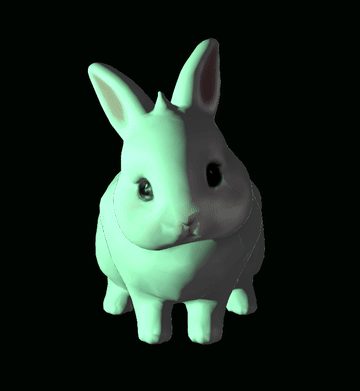

<div align="center">

<a href="https://aisli.dev/services.html"></a>


<sub><code>// active_modules : [ 'LLM' · 'NLP' · 'Machine_Learning' · 'Statistics' ]</code></sub>
<br/>


<br/><br/>

<a href="https://aisli.dev"></a>
<a href="https://aisli.dev/services.html"></a>
<a href="https://www.linkedin.com/in/asl%C4%B1-torun-734a28243"></a>
<a href="https://www.instagram.com/aisli.lab"></a>
<a href="mailto:aslitorun77@gmail.com"></a>

</div>

---

###  `> ~/whoami`

```diff
+ $ whoami
+ asli_torun · Data Scientist · ML/NLP Engineer · Antalya, TR

+ $ query: translate( raw_data → strategic_decision )
+ > processing [██████████████] 100%
+ System Output: An AI engineer who turns raw data into measurable business decisions.

+ $ cat focus.txt
+ Statistics graduate who ships. I build models that make a decision,
+ then I build the screen the team opens every morning to act on it.
```

<div align="center">


</div>

---

###  `> ~/awards`

> 🥇 &nbsp;**1st place · TourisTech Hackathon 2026** &nbsp;<code>#1 of 5 ranked finalists</code>
> Antalya Bilim Üniversitesi · backed by the West Mediterranean Development Agency · 8-member jury from academia and industry
>
> Every fourth hotel reservation ends in a cancellation. **Otelist** predicts which one at **89% accuracy**, then an AI voice agent calls the guest before the cancellation happens. A decision layer on top of the hotel's existing software, working in **48 hours**. Built with [Mehmet Coşkun](https://coskun.dev/) · [@mehmetcoskun](https://github.com/mehmetcoskun).
>
> [official announcement (BAKA)](https://baka.gov.tr/haber/touristech-hackathon-2026-odul-toreni-ile-sona-erdi/1562) · [full ranking](https://www.turizmdays.com/news/abu-touristech-hachathon-dereceye-girenler-belirlendi-33208)

---

###  `> ~/experience`

```diff
+ ● current   2026.05 — present   Backend AI Developer @ moon_workshop
  · rebuilt a healthcare client's multilingual site end-to-end, design system and docs included
  · migrated a tourism client to PHP/Laravel: scroll-triggered header, hero video, interactive mascot
  · CRM needs analysis and interface design for an immigration consultancy
  · Gemini task-orchestration assistant: NL commands, calendar sync, structured JSON output

+ 2025.09 — 2026.01   Volunteer Data Scientist @ muğla_sıtkı_koçman_üniversitesi
  · turned 153 training modules into a benchmark set via feature reduction
  · profiled students by behaviour and flagged anomalies for individualized intervention
```

---

###  `> ~/run_projects --live`

| | what it does | stack | |
|---|---|---|---|
| **[Aurelia](https://aurelia.aisli.dev)** | A personal assistant that runs your calendar and notes by voice. | `nestjs` `react_pwa` `gemini_2.5_flash` `postgres` | [`● live`](https://aurelia.aisli.dev) |
| **[Hotel Reservation Intelligence](https://github.com/333asli333/Hotel-Reservation-Intelligence)** | Tells a hotel which bookings are about to be cancelled. | `python` `random_forest` `streamlit` | [`● live`](https://hotel-reservation-intelligence-b7gtzdtejifm78xtlqomua.streamlit.app) |
| **[AI Doctor Assistant](https://github.com/333asli333/AI_doctor_assistant)** | Answers a health complaint in Turkish, tailored to the person. | `fastapi` `langchain` `llama-3.3-70b` `groq` | [`● live`](https://doctor-assistant.aisli.dev) |
| **[Bloom AI](https://github.com/333asli333/Bloom_AI_Sentiment_Analysis)** | Reads customer reviews and scores each one from 1 to 5. | `tensorflow` `keras` `lstm` `streamlit` | [`● live`](https://bloomaisentimentanalysis-6ea8crdbwrdb8jhwjxdvxo.streamlit.app) |

<details>
<summary><code>&gt; ls ~/archive</code> &nbsp;·&nbsp; 6 more projects</summary>
<br/>

| | what it does | result |
|---|---|---|
| **[Fraud Detection System](https://github.com/333asli333/Banka-anomali-tespiti)** | Flags suspicious bank transactions before the money is gone. | `AUC 0.9568 · F1 0.72` |
| **[Tourism Customer Segmentation](https://github.com/333asli333/gezinomi_project)** | Splits 59,000 holiday bookings into five customer profiles. | `59K+ records · 5 segments` |
| **[Health Insurance Cost Prediction](https://github.com/333asli333/insurance-analysis)** | Predicts what an insurance policy will cost for a given person. | `R² 0.85 · 7 models` |
| **[E-commerce Image Classification](https://github.com/333asli333/FashionTune)** | Sorts a product photo into its category and shows where it looked. | `92% accuracy` |
| **[Turkish Text Generation](https://github.com/333asli333/Turkish-Text-Generation-with-LSTM)** | Continues a Turkish sentence you start, word by word. | `next-word prediction` |
| **[E-commerce SQL Analysis](https://github.com/333asli333/flo-sql-analysis)** | Works out which sales channel and category actually earn what. | `channel revenue efficiency` |

</details>

<sub><code>&gt; full archive and the story behind each one: <a href="https://aisli.dev">aisli.dev</a></code></sub>

---

###  `> ~/stack --list`

**languages**


**ml · ai**


**data · bi**


**engineering**


---

###  `> ~/education`

```diff
+ Statistics B.Sc. · Muğla Sıtkı Koçman University · 2022–2026
  graduated · Europass Blue Diploma Supplement

+ ✓ Generative AI            BTK Akademi · 2026
+ ✓ Python & AI              MIUUL · 2025
+ ✓ Deep Learning Bootcamp   Akbank & Global AI Hub · 2025
+ ✓ R Programming            BTK Akademi · 2024
```

---

<div align="center">

<a href="https://aisli.dev/services.html">
  
</a>

<sub><code>&gt; following the white rabbit ........ ok</code></sub>
<br/>
<sub><code>&gt; you found the rabbit → <a href="https://aisli.dev/services.html">aisli.dev/services</a></code></sub>

<br/><br/>


</div>
